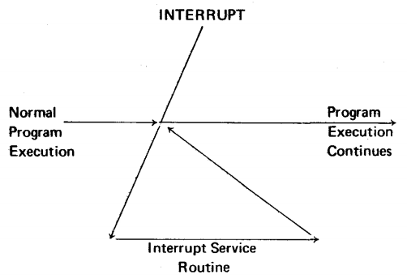

# Table of Contents

* [Running](#Running)
    * [Dependencies](#Dependencies)
    * [Compile](#Compile)
    * [Testing](#Testing)
* [Intel 8080](#Intel-8080)
    * [About](#About)
    * [Working Registers](#Working-Registers)
    * [Memory](#Memory)
    * [Program Counter](#Program-Counter)
    * [Stack Pointer](#Stack-Pointer)
    * [Condition Bits](#Condition-Bits)
    * [Instructions](#Instructions)
    * [Interrupt](#Interrupt)
* [TODO](#TODO)

# Running
## Dependencies
It requires only C standard library and tested on Linux Ubuntu 18.04. But it should work on MacOS and Windows.

## Compile
```
$ make
```

## Testing
```
$ ./intel_8080_test
```

The emulator passes the following tests:

- [x] TST8080.COM
- [x] CPUTEST.COM
- [x] 8080PRE.COM
- [x] 8080EXM.COM

The test roms (`cpu_tests` folder) are taken from [here](http://altairclone.com/downloads/cpu_tests/) and take approximately
23 seconds on my laptop (Asus Zenbook UX433FA) to run.

# Intel 8080
## About


The Intel 8080 was the second 8-bit microprocessor designed and manufactred by Intel and was released in April 1974. It  
is an extended and enhanced variant of the earlier 8008 design, although without binary compatibility. The initial  
specified clock rate or frequency limit was 2 MHz, and with common instructions using 4, 5, 7, 10, or 11 cycles this meant  
that it operated at a typical speed of a few hundred thousand instructions per second. A faster variant 8080A-1 (Sometimes  
called the 8080B) became available later with clock frequency limit up to 3.125 MHz.

The 8080 was successful enough that compatibility at the assembly language level became a design requirement for the Intel  
8086 when its design began in 1976, and led to the 8080 directly influencing all later variants of the ubiquitous 32-bit  
and 64-bit x86 architectures.

## Working Registers
The 8080 provides the programmer with an 8-bit accumulator and 6 additional 8-bit "scratchpad" registers.

These 7 woring registers are numbered and referenced via the intergers 0-5 and 7, by convention, theses registers may also  
be accessed via the letters B, C, D, E, H, L, abd A (for the accumulator), respectively.

Some 8080 operations reference the working registers in pairs referenced by the letters B, D, H and PSW.

| Register pairs | Registers referenced | 
|-|-|
| B   | B and C (0 and 1) |
| D   | D and E (2 and 3) |
| H   | H and L (4 and 5) |
| PSW | See below         |

Register pair Program Status Word (PSW) refers to register A (7) and a special byte which reflectes the current status of  
the machine flags.

## Memory
The Intel 8080 has 16 address pins, so its addresses will be 0-FFFF. It means the Intel 8080 can access up to 65kb of memory.

The programmer visualizes memory as a sequence of bytes, each of which may store 8 bits (represented by 2 hexadecimal digits).  
The bits stored in a memory byte may represent the encoded form of an intruction or may be data.

Memory Map:
```
+- - - - - - - -+ 0xFFFF (65535)
|               |
|               |
|               |
|  RAM mirror   |
|               |
|               |
|               |
+- - - - - - - -+ 0x3FFF (16383)
|               |
|   Video RAM   |
|               |
|               |
+- - - - - - - -+ 0x23FF (9215)
|               |
|    Work RAM   |
|               |
+- - - - - - - -+ 0x2000 (8192)
|               |
|     ROM       |
|               |
+- - - - - - - -+ 0x0000 (0)
```

## Program Counter
The program counter is 16-bit register which is accessible to the programmer and whose contents indicate the address of  
next intruction to be executed.

## Stack Pointer
A stack is an area of memory set aside by the programmer in which data or address are stored and retrieved by stack  
operations. Stack operations are performed by serveral of the 8080 instructions, and facilitate execution of subroutines  
and handling of program interrupts. The programmer specifies which addresses the stack operation will operate upon via a  
special accessible 16-bit register called stack pointer.

## Condition Bits
Five condition (or status) bits are provided by the 8080 to reflect the results of data operations. All but one of these  
bits (the auxiliary carry bit) may be tested by program instructions which affect subsequent program execution.

### Carry Bit
The Carry bit is set and reset by certain data operations, and its status can be directly tested by a program.  
The operations which affect the Carry bit are addition, subtraction, rotate, and logical operations.

```
Bit No.   7  6  5  4  3  2  1  0
--------------------------------
AE        1  0  1  0  1  1  1  0
+ 74      0  1  1  1  0  1  0  0
= 122     0  0  1  0  0  0  1  0
          |-> carry out = 1, set Carry bit to 1
```

### Auxiliary Carry Bit
The Auxiliary Carry Bit indicates carry out of bit 3. The state of Auxiliary Carry Bit is not directly tested by program  
instruction and is present only to enable one instruction DAA to perfrom its function.

```
Bit No.   7  6  5  4  3  2  1  0
--------------------------------
2E        0  0  1  0  1  1  1  0
+ 74      0  1  1  1  0  1  0  0
= 122     0  0  1  0  0  0  1  0
          |           |-> set Auxiliary Carry bit to 1
          |-> reset Carry bit to 0
```

The Auxiliary Carry bit will be affected by all addition, subtraction, increment, decrement, and compare instructions.

### Sign Bit
The Sign bit will be set to the condition of the most significant bit.

### Zero Bit
This condition bit is set if the result generated by the execution of certain instruction is zero. It is reset if the result  
is not zero.

```
Bit No.   7  6  5  4  3  2  1  0
--------------------------------
2E        0  0  1  0  1  1  1  0
+ D2      1  1  0  1  0  0  1  0
= 100     0  0  0  0  0  0  0  0
          |-> carry out of bit 7, set Carry bit to 1
          |-> Zero answer, set Zero bit to 1
```

### Parity Bit
Byte "parity" is checked after certain operations. The number of 1 bits in a byte are counted, and if the total is odd,  
"odd" parity is flagged; if the total is even, "even" parity is flagged.  
The Parity bit is set to 1 for even parity, and is reset to 0 for odd parity.

## Instructions
[8080 Instruction References](http://www.emulator101.com/reference/8080-by-opcode.html) or [8080 Instruction Set with color](http://pastraiser.com/cpu/i8080/i8080_opcodes.html)

## Interrupt
Interrupt sequence may be illustrated as follow:



When the CPU recognizes an interrupt request from an external device, the following actions occur:
1. The instruction currently being executed is completed
2. The interrupt flip-flop bit is reset to 0
3. The interrupt device supplies, via hardware, one instruction which the CPU executes.


_Please read "8080 Programmers Manual" document for more details about Intel 8080_